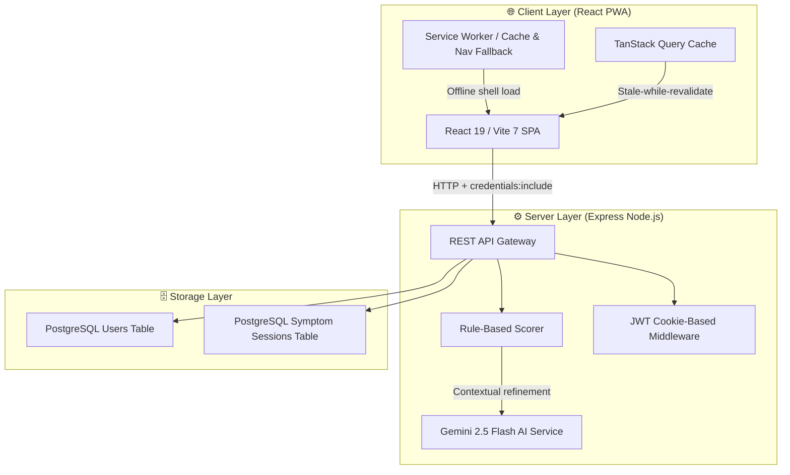

# Health Advisory System (HealthAdvisor)

**HealthAdvisor** is a modern, full-stack, Progressive Web Application (PWA) that enables users to self-report symptoms and receive medically-grounded triage advice. The application is epidemiologically scoped for **West Africa / Nigeria**, detecting 20 endemic conditions. 

It implements a hybrid diagnostic engine: a deterministic local rule-scoring model for safety and reproducibility, augmented by Google's Gemini 2.5 Flash AI for clinical contextual reasoning.

---

## Architecture Overview



---

## 📂 Monorepo Structure

The project is structured as a **pnpm workspaces monorepo** to allow maximum code and type sharing between components.

```
Health-Advisory-System/
├── artifacts/
│   ├── api-server/         # Express backend (TypeScript + ESM compiled via esbuild)
│   ├── health-advisor/     # React frontend SPA (Tailwind CSS v4 + Radix UI)
│   └── mockup-sandbox/     # UI prototyping sandbox
├── lib/
│   ├── db/                 # Shared database layer (PostgreSQL + Drizzle ORM)
│   ├── api-spec/           # OpenAPI 3.1 contract (Single Source of Truth)
│   ├── api-client-react/   # React API Hooks client (Auto-generated via Orval)
│   └── api-zod/            # Shared Zod validation schemas
├── package.json            # Root workspace config
├── pnpm-workspace.yaml     # Monorepo workspaces definition
└── render.yaml             # Render deployment configuration
```

---

## 🛠️ Technology Stack

### Frontend (`artifacts/health-advisor`)
*   **React 19 & Vite 7**: Fast, modern SPA runtime and lightning-fast developer server with Hot Module Replacement (HMR).
*   **Tailwind CSS v4**: Utility-first styling integrated natively into Vite using `@tailwindcss/vite`.
*   **Radix UI + shadcn/ui**: Accessible, headless interactive UI components (Dialogs, Selects, Toasts, Sheets).
*   **Framer Motion**: Smooth, declarative micro-animations and scroll-driven parallax effects.
*   **TanStack Query v5 (React Query)**: Handles client-side API caching, background state refetching, and query deduplication.
*   **Orval & OpenAPI 3.1**: Automatic client code-generation. Frontend hooks are generated directly from the OpenAPI spec, ensuring end-to-end type safety.

### Backend (`artifacts/api-server`)
*   **Express v5**: Node.js web server configured with ES Modules (`ESM`) and typed middleware.
*   **JWT Cookie-Based Auth**: Stateless user authentication. Signed JWTs are issued upon login and stored in secure, **HTTP-Only** cookies (`token`), protecting them against XSS.
*   **Pino**: High-performance, structured JSON logging piped via worker threads.

### Database (`lib/db`)
*   **PostgreSQL**: ACID-compliant relation store (compatible with Neon or Render managed Postgres).
*   **Drizzle ORM**: Lightweight TypeScript-first ORM compiling directly to raw SQL queries without runtime overhead.
*   **Drizzle Kit**: Automatically syncs database tables with TypeScript schema files.

---

## 🧠 Hybrid Diagnostic Engine

The backend processes symptoms in two distinct steps to deliver safe, highly relevant advice:

### Step 1: Rule-Based Scoring (Deterministic)
The server runs a local scoring algorithm against 20 key conditions:
*   Matches symptoms against defined lists.
*   Enforces `requiredSymptoms` (e.g., fever *must* be present for a Malaria diagnosis).
*   Sorts and filters matching conditions.
*   **Supported Diseases**: Malaria, Severe Malaria, Typhoid Fever, Dengue Fever, Hepatitis, Gastroenteritis, Cholera, Peptic Ulcer, Intestinal Worms, Hypertension, Diabetes, Sickle Cell Crisis, Anaemia, Influenza, Common Cold, Meningitis, UTI, Cellulitis, Conjunctivitis, and Appendicitis.

### Step 2: Gemini AI Enrichment (Generative)
The results from the rule scorer are enriched using **Gemini 2.5 Flash**:
*   Weights symptom duration, age, gender, and regional epidemiological factors.
*   Constrains model responses strictly to JSON matching a structured JSON Schema.
*   **Graceful Fallback**: If Gemini fails or the API quota is exceeded, the engine degrades gracefully to the rule-based output without failing the request.

---

## ⚙️ Local Setup Guide

Follow these steps to run the complete environment on a local machine:

### 1. Prerequisites
Ensure you have the following installed:
*   **Node.js** (v20+ recommended)
*   **pnpm** (v10+ recommended)
*   **PostgreSQL** (running locally or a remote connection string)

### 2. Clone and Install Dependencies
Install all workspace packages bypassing Windows shell scripts using `--ignore-scripts`:
```powershell
npx pnpm install --ignore-scripts
```

### 3. Setup Environment Variables
Create a `.env` file in the backend directory (`artifacts/api-server/.env`) or set these variables globally in your environment:

```env
DATABASE_URL=postgresql://<user>:<password>@localhost:5432/<dbname>
JWT_SECRET=your_super_secret_jwt_hmac_signing_key_here
GEMINI_API_KEY=your_gemini_api_key_from_google_ai_studio
NODE_ENV=development
PORT=3000
```

### 4. Push Database Schema
Apply the Drizzle schemas directly to your local or remote database:
```powershell
npx pnpm --filter @workspace/db run push
```

### 5. Build Workspace
Build shared dependencies, OpenAPI client schemas, and build configurations:
```powershell
npx pnpm run build
```

### 6. Start Development Servers
*   **Start Backend API Server**:
    In a terminal, navigate to `artifacts/api-server` and run:
    ```powershell
    npx pnpm run dev
    ```
*   **Start Frontend Vite Server**:
    In a separate terminal, navigate to `artifacts/health-advisor` and run:
    ```powershell
    npx pnpm run dev
    ```
    Open your browser and navigate to the address outputted by Vite (typically `http://localhost:5173`).

---

## 🚀 Production Deployment (Render)

This workspace is fully prepared for one-click deployment to **Render** via `render.yaml`:

1.  Connect your repository to Render.
2.  Set up the following environment variables in the Render dashboard:
    *   `DATABASE_URL`: Your managed Postgres database URI.
    *   `JWT_SECRET`: A secure, persistent random string used to sign user auth cookies.
    *   `GEMINI_API_KEY`: Your Google AI Gemini developer key.
3.  The build pipeline automatically compiles libraries, builds Vite static assets, executes database pushes, and boots the Node.js production container.

---

## 🔒 Security Configuration

*   **HTTP-Only Cookies**: JWT tokens are inaccessible to browser scripts, eliminating XSS extraction risk.
*   **CSRF Defenses**: SameSite is configured dynamically (`none` + `secure` in HTTPS production, `lax` locally).
*   **Supply Chain Guardrails**: `pnpm` is configured with `minimumReleaseAge: 1440` in `.npmrc` to prevent the installation of packages published less than 24 hours ago, mitigating zero-day dependency hijackings.
